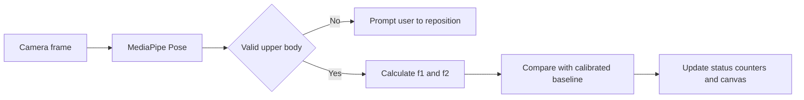

# Posture Monitor

Posture Monitor is a static web application that uses MediaPipe Pose to estimate upper-body landmarks and provide real-time posture feedback. Camera frames are processed in the browser and are not uploaded by this project.

## Features

- Live posture feedback for upright, slouching, and lateral leaning states
- User calibration for different body proportions and camera angles
- Five geometric checks that reject incomplete or implausible upper-body detections
- Session timer plus slouch and lean event counters
- Responsive, accessible interface with clear camera and tracking status
- No application server or account required

## How it works



The browser computes two normalized geometric features:

- `f1` measures left-right asymmetry between face-to-shoulder distances.
- `f2` measures the combined face-to-shoulder distance relative to shoulder width.

The classifier compares those measurements with a baseline. Before calibration it uses conservative defaults; after calibration it uses the user's current upright pose. This is a heuristic posture aid, not a medical device or diagnostic tool.

## Project structure

```text
.
|-- index.html                 Web interface
|-- style.css                  Responsive presentation
|-- script.js                  Camera, MediaPipe, geometry, and UI logic
|-- vercel.json                Static Vercel configuration
|-- requirements.txt           Optional Python tooling dependencies
|-- data/
|   `-- hf_posture_dataset.csv  Reference dataset for exploration
|-- docs/
|   |-- CONFERENCE_REPORT.docx
|   |-- PROJECT_THESIS.docx
|   `-- TEAM_ROLES.md
`-- tools/
    |-- fetch_dataset.py       Re-downloads the reference dataset
    `-- generate_docs.py      Rebuilds the Word reports
```

> [!NOTE]
> **Dataset Disclaimer**: The reference dataset in the `data/` directory is originally from a Kaggle "Confidence Detection" dataset. Although its original goal was to predict confidence levels based on sitting habits, it was selected for this project because it provides a reliable, pre-extracted set of MediaPipe landmarks mapping explicitly to slouching and upright postures.
> 
> The dataset contains `Upright`, `Stiff`, and `Slouched` labels. Its schema does not match the live `f1` and `f2` features used in this application, and it has no lateral-lean class. Therefore, it is retained solely for exploration, reproducibility, and reference. It is **not** used to train the live heuristic browser classifier, which relies entirely on real-time geometric math.

## Run locally

Camera access requires a secure context. Localhost is treated as secure by modern browsers.

```powershell
python -m http.server 8000
```

Open [http://localhost:8000](http://localhost:8000), allow camera access, sit fully in frame, and select **Calibrate posture** while sitting upright.

The page loads MediaPipe and Google Fonts from public CDNs, so the first load requires an internet connection.

## Optional Python tools

Create an environment and install the tooling dependencies:

```powershell
python -m venv .venv
.venv\Scripts\Activate.ps1
python -m pip install -r requirements.txt
```

Re-download the reference dataset:

```powershell
python tools\fetch_dataset.py
```

Rebuild the Word reports:

```powershell
python tools\generate_docs.py
```

## Deploy

The application is static and can be deployed to Vercel or another HTTPS static host. Keep `index.html`, `style.css`, and `script.js` together at the site root.

## Privacy and limitations

- This project does not transmit or store camera frames.
- MediaPipe assets and fonts are fetched from third-party CDNs.
- Counts are session-only and reset when the page reloads.
- Accuracy depends on lighting, camera placement, visibility, and calibration.
- The tool should not be used to diagnose or treat a health condition.
